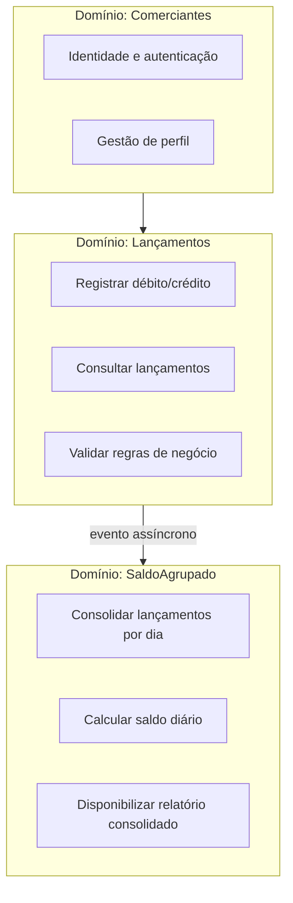
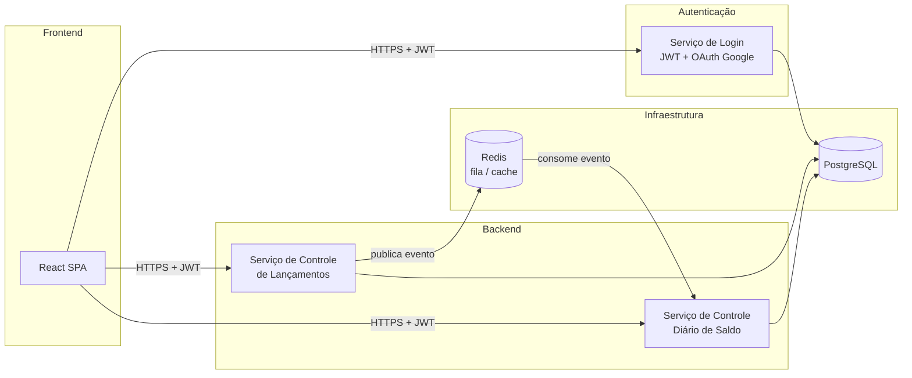
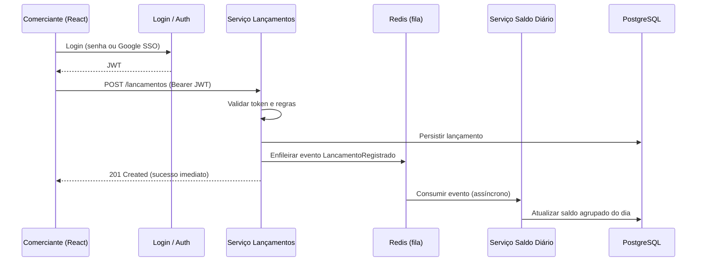

# Requisitos Obrigatórios — Controle de Lançamentos

> Documento derivado do desafio **Arquiteto de Soluções (Jun/25)**  
> Problema de negócio: o comerciante precisa controlar o fluxo de caixa diário (débitos e créditos) e consultar o **saldo diário consolidado**.

---

## 1. Mapeamento de domínios funcionais e capacidades de negócio

### 1.1 Contexto de negócio

| Capacidade de negócio | Descrição | Valor entregue |
|----------------------|-----------|----------------|
| **Controlar fluxo de caixa** | Registrar entradas (créditos) e saídas (débitos) do comerciante | Visibilidade financeira operacional |
| **Consolidar saldo diário** | Agrupar lançamentos por dia e calcular saldo | Relatório de posição financeira por dia |
| **Autenticar comerciante** | Garantir que apenas o titular acesse seus dados | Segurança e segregação por usuário |

### 1.2 Domínios funcionais

#### Domínio: **Comerciantes**

| Capacidade | Responsabilidade |
|------------|------------------|
| Autenticação | Login com usuário/senha ou SSO Google |
| Autorização | Emissão e validação de token JWT |
| Identificação | Associar lançamentos e saldos ao comerciante autenticado |

#### Domínio: **Lançamentos**

| Capacidade | Responsabilidade |
|------------|------------------|
| Registrar movimentação | CRUD de débitos e créditos com data, valor e descrição |
| Consultar histórico | Listagem e filtros por período |
| Publicar evento | Notificar o domínio de consolidação após persistência |

> **Serviço de negócio correspondente (PDF):** *Serviço que faça o controle de lançamentos*.

#### Domínio: **SaldoAgrupado**

| Capacidade | Responsabilidade |
|------------|------------------|
| Consolidar por dia | Agrupar lançamentos do comerciante por data de referência |
| Calcular saldo | Somar créditos e subtrair débitos do dia |
| Expor relatório | Disponibilizar saldo diário consolidado para consulta |

> **Serviço de negócio correspondente (PDF):** *Serviço do consolidado diário*.

### 1.3 Segregação e fronteiras

- **Comerciantes** concentra identidade e acesso; não conhece regras de consolidação.
- **Lançamentos** é o domínio transacional principal; deve permanecer disponível mesmo com falha no consolidado.
- **SaldoAgrupado** é domínio derivado (read model / projeção); processa eventos de forma assíncrona e tolerante a picos.

---

## 2. Refinamento do levantamento de requisitos

### 2.1 Requisitos funcionais

| ID | Requisito | Domínio | Prioridade |
|----|-----------|---------|------------|
| RF01 | O comerciante deve **autenticar-se** (usuário/senha ou SSO Google) para acessar o sistema | Comerciantes | Obrigatório |
| RF02 | Após login, o sistema deve emitir **token JWT** para consumo das APIs | Comerciantes | Obrigatório |
| RF03 | O comerciante autenticado deve **registrar lançamentos** (débito ou crédito) | Lançamentos | Obrigatório |
| RF04 | O comerciante deve **consultar** seus lançamentos (por período/data) | Lançamentos | Obrigatório |
| RF05 | Cada lançamento registrado deve **disparar atualização** do serviço de consolidação diária | Lançamentos → SaldoAgrupado | Obrigatório |
| RF06 | O sistema deve **calcular e exibir o saldo diário consolidado** por comerciante | SaldoAgrupado | Obrigatório |
| RF07 | O comerciante deve **consultar relatório** de saldos agrupados por dia | SaldoAgrupado | Obrigatório |
| RF08 | Lançamentos de um comerciante **não podem ser acessados** por outro comerciante | Comerciantes / Lançamentos | Obrigatório |

#### Regras de negócio complementares

- Lançamento possui: tipo (DÉBITO/CRÉDITO), valor positivo, data de competência, descrição opcional.
- Saldo diário = Σ créditos − Σ débitos na data de referência.
- Consolidação é **eventual**: pode haver atraso entre o lançamento e a atualização do saldo agrupado.

### 2.2 Requisitos não funcionais

| ID | Categoria | Requisito | Meta / critério |
|----|-----------|-----------|-----------------|
| RNF01 | **Disponibilidade** | O serviço de lançamentos **não pode ficar indisponível** se o consolidado diário cair | Lançamentos opera com degradação graceful; consolidação reprocessa depois |
| RNF02 | **Desempenho** | Em dias de pico, o consolidado recebe **50 req/s** com no máximo **5% de perda** | Fila + workers; retry; métricas de throughput e dead-letter |
| RNF03 | **Segurança** | Autenticação via **OAuth 2.0 / JWT** | Token com expiração; validação em gateway ou resource server |
| RNF04 | **Segurança** | Login por **usuário/senha** ou **SSO Google** | Dois fluxos de autenticação suportados |
| RNF05 | **Escalabilidade** | Serviços stateless horizontalmente escaláveis | Réplicas atrás de load balancer |
| RNF06 | **Resiliência** | Comunicação assíncrona entre Lançamentos e SaldoAgrupado | Redis (fila/cache) como buffer desacoplador |
| RNF07 | **Manutenibilidade** | Stack amplamente adotada no mercado | Java/Spring, React, PostgreSQL |
| RNF08 | **Observabilidade** | Logs estruturados e rastreabilidade de eventos | Correlation ID por lançamento (diferencial recomendado) |
| RNF09 | **Custo** | Banco relacional de baixo custo operacional | PostgreSQL (open source) |

#### Requisito crítico do desafio (PDF)

> *"O serviço de controle de lançamento não deve ficar indisponível se o sistema de consolidado diário cair."*

**Decisão derivada:** persistir o lançamento primeiro; publicar evento em fila (Redis); consolidado consome de forma independente. Falha no consolidado **não bloqueia** a API de lançamentos.

---

## 3. Desenho da solução completo (Arquitetura Alvo)

### 3.1 Visão de containers

### 3.2 Fluxo principal — registrar lançamento

### 3.3 Componentes e responsabilidades

| Componente | Tecnologia sugerida | Responsabilidade |
|------------|---------------------|------------------|
| **Frontend** | React | Telas de login, lançamentos e relatório de saldo diário |
| **Serviço de Login** | Spring Boot + Spring Security + OAuth2 | Autenticação local e SSO Google; emissão JWT |
| **Serviço de Lançamentos** | Spring Boot | API transacional de débitos/créditos; publicação de eventos |
| **Redis** | Redis Streams ou List | Buffer assíncrono; desacopla lançamentos do consolidado |
| **Serviço Saldo Diário** | Spring Boot (consumer) | Consolidação por dia; atende consultas de relatório |
| **PostgreSQL** | PostgreSQL | Persistência relacional (lançamentos, saldos, usuários) |

### 3.4 Padrão arquitetural

**Microserviços orientados a domínio** com **comunicação assíncrona** entre Lançamentos e SaldoAgrupado.

| Aspecto | Escolha |
|---------|---------|
| Estilo | Microserviços (2 serviços de negócio + auth) |
| Integração síncrona | REST/HTTPS entre frontend e APIs |
| Integração assíncrona | Eventos via Redis entre Lançamentos → SaldoAgrupado |
| Consistência | **Eventual** entre lançamento e saldo consolidado |
| Tipo de dados | PostgreSQL transacional; Redis efêmero/de fila |

### 3.5 Atendimento aos picos (50 req/s, ≤ 5% perda)

1. Lançamentos enfileira eventos em Redis (operacao O(1), baixa latência).
2. Serviço de Saldo escala horizontalmente (N consumidores).
3. Retry com backoff para falhas transientes.
4. Dead-letter queue para eventos não processados (reprocessamento manual/automático).
5. Métricas: taxa de consumo, lag da fila, taxa de erro.

---

## 4. Justificativa de ferramentas, tecnologias e tipo de arquitetura

### 4.1 Tipo de arquitetura: microserviços desacoplados

| Critério | Justificativa |
|----------|---------------|
| Isolamento de falhas | Queda do consolidado **não derruba** lançamentos (requisito obrigatório do PDF) |
| Escalabilidade independente | Consolidado escala sob pico (50 req/s) sem impactar API de lançamentos |
| Alinhamento a domínios | Comerciantes, Lançamentos e SaldoAgrupado viram serviços/fronteiras claras |
| Trade-off aceito | Maior complexidade operacional vs. monolito; compensada por Redis + 2 serviços pequenos |

### 4.2 Stack tecnológica

| Tecnologia | Papel | Justificativa |
|------------|-------|---------------|
| **Java + Spring Boot** | Backend (APIs, segurança, consumers) | Ecossistema maduro; Spring Security para JWT/OAuth; ampla adoção corporativa; facilita contratação e manutenção |
| **React** | Frontend SPA | Alta adoção no mercado; ecossistema atualizado (hooks, routers, libs UI); boa produtividade para dashboards e formulários |
| **PostgreSQL** | Banco relacional | Open source, baixo custo; ACID para lançamentos financeiros; histórico sólido; ampla comunidade e tooling |
| **Redis** | Fila / cache | Baixa latência; desacoplamento assíncrono; suporta picos sem bloquear lançamentos; padrão conhecido para messaging leve |
| **JWT + OAuth 2.0** | Segurança | Padrão stateless para APIs; interoperável; SSO Google via OAuth2 amplamente utilizado no mercado |
| **SSO Google** | Autenticação federada | Reduz fricção de cadastro; confiança do usuário; prática comum em aplicações B2C e B2B leves |

### 4.3 Decisões arquiteturais registradas (ADR resumido)

| Decisão | Alternativa descartada | Motivo |
|---------|------------------------|--------|
| Evento assíncrono via Redis | Chamada HTTP síncrona Lançamentos → Consolidado | Síncrono violaria RNF01 em caso de queda do consolidado |
| JWT stateless | Sessão server-side apenas | Escala horizontal mais simples nas APIs |
| PostgreSQL | MongoDB / NoSQL | Lançamentos financeiros exigem consistência transacional forte |
| React SPA | Server-side templates | Melhor UX para telas interativas de lançamento e relatório |
| SSO Google + login local | Apenas login local | Atende requisito de OAuth e melhora onboarding |

### 4.4 Segurança no consumo de serviços

- Todas as APIs de negócio exigem **Bearer JWT** válido.
- Claims do token incluem `sub` (comerciante) para filtro de dados.
- Comunicação externa via **HTTPS**.
- Segredos (Google OAuth client secret, JWT signing key) em variáveis de ambiente / vault.
- Redis e PostgreSQL em rede privada, sem exposição pública.

---

## 5. Referência cruzada com o desafio

| Item obrigatório (PDF) | Seção deste documento |
|------------------------|----------------------|
| Mapeamento de domínios e capacidades | § 1 |
| Refinamento funcional e não funcional | § 2 |
| Arquitetura alvo completa | § 3 |
| Justificativa de tecnologias e arquitetura | § 4 |
| Serviço de controle de lançamentos | § 1.2 — Domínio Lançamentos |
| Serviço do consolidado diário | § 1.2 — Domínio SaldoAgrupado |
| Lançamentos indisponíveis se consolidado cair (**não**) | § 2.2 RNF01 + § 3 |
| Pico 50 req/s, ≤ 5% perda no consolidado | § 2.2 RNF02 + § 3.5 |

---

## 6. Evoluções futuras (fora do escopo mínimo)

- Arquitetura de transição a partir de sistema legado (requisito diferencial).
- Estimativa de custos de infraestrutura e licenças (requisito diferencial).
- Observabilidade completa: Prometheus, Grafana, tracing distribuído (requisito diferencial).
- Idempotência de eventos e exactly-once semantics na consolidação.
- API de exportação (CSV/PDF) do relatório de saldo diário.
